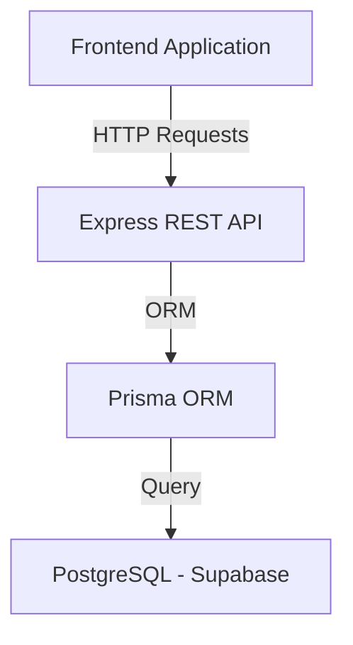

# Portfolio Backend & CMS 🚀

---

## 📖 Project Description

This repository contains the robust and scalable backend system for my personal portfolio. It acts as a Headless CMS (Content Management System) that reliably handles and manages portfolio projects, queries, and user contact submissions. 

## 🎯 Purpose, Goals & Objectives

- **Centralized Data Management**: Provide a single, reliable source of truth for all dynamic portfolio content and project details.
- **Efficient Query Handling**: Seamlessly capture, route, store, and manage incoming user queries and contact form messages.
- **Scalability**: Utilize a scalable stack to easily adapt to future enhancements, higher traffic, and data structural changes.
- **Clean Architecture**: Support rapid deployment and iterations through a cleanly structured, modular codebase.

## ✨ Project Features

- **CMS Capabilities**: Manage, sort, and store portfolio projects effectively.
- **Contact & Query Management**: Dedicated endpoints to securely receive, validate, and store contact form messages.
- **Structured Data Storage**: Relational database modeling using PostgreSQL to ensure robust data integrity.
- **Robust Error Handling**: Centralized middleware for clear and consistent API error responses.
- **Controller-Service Architecture**: Strict separation of concerns (Business Logic from Routing).

## 🏗️ System Architecture

The overarching system architecture leverages a performant Node.js stack with modern structural conventions:
- **Runtime Environment**: `Node.js` for fast server-side execution.
- **Web Framework**: `Express.js` for handling HTTP routing, middleware processing, and core API logic.
- **ORM (Object-Relational Mapping)**: `Prisma ORM` for safe, type-aware interactions with the database and schema synchronization.
- **Database Backend**: `Supabase` (powered by PostgreSQL) utilized for reliable, fast, and secure structured data storage, relations, and optimized querying/sorting.

---

## 🌐 Frontend Application

This backend directly feeds and manages data for the primary portfolio frontend interface.

**Live Project:** [https://phurpasherpa-portfolio.netlify.app/](https://phurpasherpa-portfolio.netlify.app/)  
*(The frontend application consumes this backend API and utilizes it for displaying projects and submitting user contact queries.)*